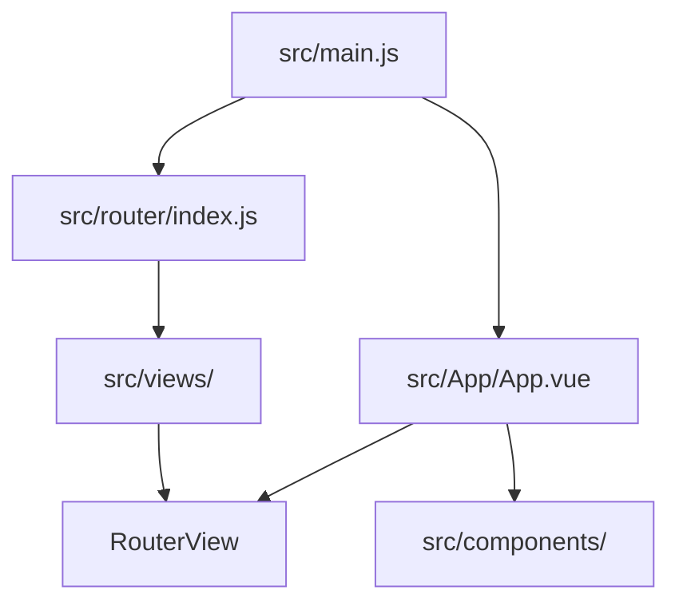

# Site architecture

This is a Vue 3 single-page portfolio built with Vite and Vue Router. It has no application backend in this repository. Pages describe work and link to static files; avoid inferring details about the systems described by those pages.

| Location | Responsibility |
| --- | --- |
| `src/main.js` | Import site styles and libraries, register the router, and mount the app. |
| `src/App/App.vue` | Shared shell with `NavBar`, `RouterView`, and `SiteFooter`. |
| `src/router/index.js` | URL-to-view mapping. The home view is imported directly; other views use route-level dynamic imports. |
| `src/views/<Name>/<Name>.vue` | One route's portfolio content. Each tested view keeps `<Name>.spec.js` beside the component. |
| `src/components/<Name>/<Name>.vue` | Reusable UI, with its test beside it when behavior or rendered content warrants testing. `src/components/icons/` holds static icons. |
| `src/assets/css/site.css`, `src/assets/images/` | Site styling and imported images. Bootstrap and Font Awesome are also loaded from `src/main.js`. |
| `public/files/` | Files served directly from `/files/...`, including the resume. |
| `vite.config.js`, `vitest.config.js` | Build/alias and test setup. `@` points to `src/`; Vitest uses jsdom. |
| `.github/workflows/deploy.yml` | Builds, tests, and lints PRs; deploys a successful push to `main` to S3 and invalidates CloudFront. |

## Trace a page change

For `/rulesengine`, start at the route in `src/router/index.js`, then read `src/views/RulesEngine/RulesEngine.vue` and its colocated `RulesEngine.spec.js`. Check `src/components/NavBar/NavBar.vue` and `src/views/HomeView/HomeView.vue` for links to the page. Reuse the relevant styles in `src/assets/css/site.css` and existing Bootstrap utilities.

When adding a page, create its view directory and colocated test, register the route, and add navigation or project links where appropriate. When changing shared UI, inspect its other callers and test the behavior they depend on.
